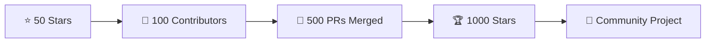

<div align="center">

<!-- Banner -->


# 🎃 Hacktoberfest HTML/CSS/JS Repository

<p align="center">
  
  
  
  
  
  
  
</p>

<p align="center">
  <strong>🌟 Your gateway to open source contributions during Hacktoberfest! 🌟</strong>
</p>

<p align="center">
  A beginner-friendly repository featuring HTML, CSS, JavaScript projects, and DSA implementations.<br>
  Perfect for developers at any skill level looking to make their mark in open source!
</p>


</div>

---

## 📊 Repository Stats

<div align="center">


</div>

---

## 🎯 About This Project

<table>
<tr>
<td width="50%">

### 🚀 Mission
Provide a welcoming space for developers to:
- 🎓 Learn open source workflows
- 💻 Practice web development skills
- 🤝 Collaborate with a global community
- 🏆 Earn Hacktoberfest achievements

</td>
<td width="50%">

### ✨ Features
- 📱 Responsive HTML/CSS components
- ⚡ Interactive JavaScript utilities
- 🧮 DSA implementations in JS
- 📚 Well-documented codebase
- 🎨 Clean, modular structure

</td>
</tr>
</table>

---

## 🏗️ Project Architecture

```
📦 Hacktoberfest-Html_CSS_JS/
│
├── 📂 html/                    # HTML Components & Templates
│   └── 📄 index.html          # Main entry point
│
├── 📂 css/                     # Stylesheets & Design System
│   └── 🎨 style.css           # Core styling
│
├── 📂 js/                      # JavaScript Modules
│   └── ⚡ script.js           # Main functionality
│
├── 📂 dsa_in_js/              # Data Structures & Algorithms
│   └── 🔍 binary_search.js    # Algorithm implementations
│
├── 📄 README.md               # You are here!
├── 📄 CONTRIBUTING.md         # Contribution guidelines
├── 📄 LICENSE                 # MIT License
└── 📄 Contributor.md          # Hall of fame
```

---

## 🤝 How to Contribute

<div align="center">

### ⚠️ **Important: Get Assigned First!**
**Before starting work, create an issue and wait for maintainer assignment to avoid duplicate efforts.**

</div>

### 🔄 Quick Start Guide

<table>
<tr>
<td>

#### 1️⃣ Fork & Star
```bash
# Click the 'Fork' button at the top right
# Don't forget to star ⭐ the repo!
```

</td>
<td>

#### 2️⃣ Clone Repository
```bash
git clone https://github.com/YOUR-USERNAME/Hacktoberfest-Html_CSS_JS.git
cd Hacktoberfest-Html_CSS_JS
```

</td>
</tr>
<tr>
<td>

#### 3️⃣ Create Branch
```bash
git checkout -b feature/amazing-feature
```

</td>
<td>

#### 4️⃣ Make Changes
```bash
# Edit files, add features
# Write clean, commented code
```

</td>
</tr>
<tr>
<td>

#### 5️⃣ Commit & Push
```bash
git add .
git commit -m "feat: add amazing feature"
git push origin feature/amazing-feature
```

</td>
<td>

#### 6️⃣ Create Pull Request
```bash
# Go to original repo
# Click 'New Pull Request'
# Fill in the details & submit!
```

</td>
</tr>
</table>

---

## 📝 Contribution Areas

<div align="center">

| 🎨 Frontend | ⚡ JavaScript | 🧮 Algorithms | 📚 Documentation |
|:---:|:---:|:---:|:---:|
| HTML Components | Interactive Features | DSA Solutions | Guides & Tutorials |
| CSS Animations | Utility Functions | Problem Solving | Code Examples |
| Responsive Design | DOM Manipulation | Optimization | API Documentation |

</div>

---

## ✅ Contribution Guidelines

<table>
<tr>
<td width="50%">

### ✨ Do's
- ✅ Create meaningful contributions
- ✅ Follow existing code style
- ✅ Add comprehensive comments
- ✅ Test thoroughly before submitting
- ✅ Update relevant documentation
- ✅ Write descriptive commit messages

</td>
<td width="50%">

### ❌ Don'ts
- ❌ Submit spammy/low-quality PRs
- ❌ Make changes without assignment
- ❌ Copy-paste without understanding
- ❌ Break existing functionality
- ❌ Ignore feedback from maintainers
- ❌ Submit duplicate contributions

</td>
</tr>
</table>

---

## 🎖️ Add Yourself to Contributors

After your PR is merged, add yourself to `Contributor.md`:

```markdown
### Format:
1. Your Name | [LinkedIn](https://linkedin.com/in/your-profile) | [GitHub](https://github.com/your-username)
    - Brief description of your contribution

### Example:
1. Harshit Pachori | [LinkedIn](https://linkedin.com/in/harshitpachori) | [GitHub](https://github.com/HarshitPachori)
    - Added Bento Grid example in HTML/CSS
    - Implemented responsive navigation component
```

> **Note:** If your name exists, add new contributions on the next line with two tabs. No duplicate entries!

---

## 👨‍💻 Maintainers

<div align="center">
<table>
<tr>
<td align="center" width="50%">
<a href="https://github.com/HarshitPachori">
<br />
<sub><b>Harshit Pachori</b></sub>
</a><br />
<a href="https://github.com/HarshitPachori" title="GitHub">💻</a>
<a href="https://linkedin.com/in/harshitpachori" title="LinkedIn">💼</a>
<a href="#" title="Review">👀</a>
</td>
<td align="center" width="50%">
<a href="https://github.com/ayushHardeniya">
<br />
<sub><b>Ayush Sharma</b></sub>
</a><br />
<a href="https://github.com/ayushHardeniya" title="GitHub">💻</a>
<a href="https://linkedin.com/in/ayushHardeniya" title="LinkedIn">💼</a>
<a href="https://twitter.com/ayushHardeniya" title="Twitter">🐦</a>
</td>
</tr>
</table>
**Need help?** Tag maintainers in your issues or PRs!
</div>

---

## 🌟 Our Amazing Contributors

<div align="center">

### 🎉 Thank you to all our contributors!

<a href="https://github.com/HarshitPachori/Hacktoberfest-Html_CSS_JS/graphs/contributors">
  
</a>

### **Join the List!**
Make your first contribution and see your avatar here! Every contribution counts. 🚀


</div>

---

## 🏆 Contribution Activity

<div align="center">


</div>

---

## 💬 Get Support

<table>
<tr>
<td width="25%" align="center">

### 🐛 Found a Bug?
[Report Issue](https://github.com/HarshitPachori/Hacktoberfest-Html_CSS_JS/issues/new)

</td>
<td width="25%" align="center">

### 💡 Have an Idea?
[Suggest Feature](https://github.com/HarshitPachori/Hacktoberfest-Html_CSS_JS/issues/new)

</td>
<td width="25%" align="center">

### ❓ Need Help?
[Start Discussion](https://github.com/HarshitPachori/Hacktoberfest-Html_CSS_JS/discussions)

</td>
<td width="25%" align="center">

### 📧 Contact Us
[Reach Maintainers](https://github.com/HarshitPachori)

</td>
</tr>
</table>

---

## 🎓 Resources

<div align="center">

| Resource | Link |
|:---|:---:|
| 🎃 Hacktoberfest Official | [hacktoberfest.com](https://hacktoberfest.com) |
| 📖 Git Handbook | [guides.github.com](https://guides.github.com) |
| 🎯 First Contributions | [firstcontributions.github.io](https://firstcontributions.github.io) |
| 💻 HTML/CSS Guide | [developer.mozilla.org](https://developer.mozilla.org) |
| ⚡ JavaScript Info | [javascript.info](https://javascript.info) |

</div>

---

## 📜 License

<div align="center">

This project is licensed under the **MIT License**

[](https://opensource.org/licenses/MIT)

Free to use, modify, and distribute. Attribution appreciated!

[View Full License](LICENSE)

</div>

---

## 🎯 Project Milestones

<div align="center">



**Help us reach the next milestone!**

</div>

---

## 📈 Weekly Stats

<div align="center">


</div>

---

## 🌐 Connect With Us

<div align="center">

[](https://github.com/HarshitPachori)
[](https://linkedin.com/in/harshitpachori)
[](https://twitter.com)

</div>

---

<div align="center">

### 🎃 Happy Hacktoberfest! 🎃

**Remember: Quality > Quantity**

Make contributions that matter, learn from the community, and have fun coding!


⭐ **Star this repo if you found it helpful!** ⭐


**Made with ❤️ by the Open Source Community**

</div>